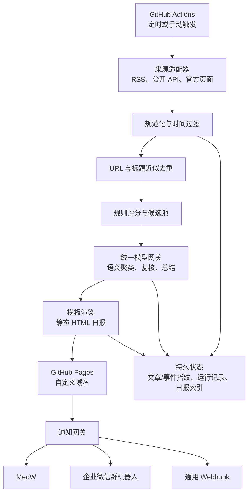

# AI 新闻嗅探器设计规格

日期：2026-07-23

状态：已通过对话评审，等待书面规格复核

## 1. 目标

构建一个无人值守的个人 AI 新闻日报系统。系统每天从全球中英文公开来源采集 AI 新闻，筛选出 8–15 条高价值内容，统一生成中文移动端 HTML 日报并发布到 GitHub Pages；随后通过 MeoW 等通知通道在北京时间 21:00 左右提醒用户查看。

系统优先保证高信噪比、来源可追溯、低运行成本和可扩展性。技术、模型、开源项目和 AI 产品略微加权，同时保留真正重要的商业、投融资、并购和政策监管事件。

### 1.1 成功标准

- 每天北京时间 21:00 左右自动运行，允许 GitHub Actions 因平台调度产生少量延迟。
- 正常情况下发布 8–15 条高价值新闻；信息不足时宁可发布更短的日报，也不使用低质量内容凑数。
- 中英文来源统一输出中文。
- 同一事件的多篇报道合并展示，不作为多条新闻重复出现。
- 每条新闻包含标题、2–3 句事实摘要、“为什么重要”、主要原文和相关来源。
- 日报页面适合手机单列阅读，可通过自定义域名访问，并保留历史归档。
- 通知包含当日总览、3 条头条和完整日报链接。
- 支持手动触发、预览和不发送真实通知的 `dry-run`。
- 模型、新闻源、关注方向、模板和通知通道均可通过配置扩展。

## 2. 首版范围

### 2.1 包含

- GitHub Actions 定时运行和手动运行。
- 免费公开来源采集。
- 规则清洗、过滤、评分和两层确定性去重。
- 模型参与的语义事件合并、重要性复核、排序和中文总结。
- DeepSeek 作为首个模型供应商。
- Kimi、MiniMax 及其他模型的可扩展适配接口。
- 静态 HTML 日报、日期索引和历史归档。
- GitHub Pages 发布和自定义域名支持。
- MeoW、企业微信群机器人和通用 Webhook 通知适配器。
- 仓库目录式 HTML/CSS 模板扩展。
- 运行状态、事件指纹和日报索引持久化。

### 2.2 不包含

- 新闻或模板管理后台。
- 网页端模板上传。
- 用户账户、登录和多租户权限。
- 付费搜索 API。
- 自动全文转载或绕过付费墙。
- 实时新闻推送；首版仅生成每日一期日报。
- 原生手机 App。

## 3. 总体架构

系统采用“规则管线 + AI 编辑”方案。确定性任务由程序完成，需要语义判断的任务才交给模型。

### 3.1 运行方式

- 正式定时任务通过 GitHub Actions 执行，不依赖个人电脑开机。
- GitHub Actions 使用 `0 13 * * *` 作为默认 UTC Cron，对应北京时间 21:00。
- 允许平台调度造成少量延迟，不承诺整点秒级执行。
- 提供 `workflow_dispatch` 手动入口。
- 手动入口至少支持：
  - `dry_run`：生成和校验预览，不发布、不推送；预览站点作为 GitHub Actions Artifact 下载。
  - `publish`：发布 HTML。
  - `notify`：在发布成功后向真实通道发送通知。
  - 可选运行日期：用于重跑指定日期或验证历史数据。
- 工作流设置并发锁，同一目标日期只允许一个发布任务修改正式产物。

## 4. 组件与边界

### 4.1 调度器

负责准备运行参数、加载配置、串联各阶段、记录结果并设置最终退出状态。调度器不包含新闻解析、模型调用或通道格式化的具体实现。

### 4.2 来源适配器

每个适配器只负责从一种来源获取候选条目，并转换成统一的原始新闻结构。首版来源包括：

- 主要 AI 公司、研究机构和产品的官方博客或 RSS。
- 可信科技媒体 RSS。
- arXiv 中与 AI、机器学习、自然语言处理相关的公开条目。
- 配置中关注仓库的 GitHub Releases。
- Hacker News 等公开技术社区入口。

来源清单、启停状态、类别和基础权重均写入配置，不硬编码在业务逻辑中。首版不接入付费搜索 API，但保留新的来源适配器接口。

### 4.3 规范化器

统一生成以下字段：

- `id`
- `title`
- `url`
- `canonical_url`
- `source_id`
- `source_name`
- `published_at`
- `fetched_at`
- `language`
- `excerpt`
- `categories`
- `author`（来源提供时）
- `raw_metadata`

所有时间转换为带时区的标准格式；展示时再转换为北京时间。

### 4.4 去重器

去重分三层：

1. URL 去重：移除常见跟踪参数，规范化 URL，合并完全相同的链接。
2. 标题近似去重：清洗标题中的站点名、无意义标点和大小写差异，基于文本相似度合并转载及轻微改写标题。
3. AI 语义事件聚类：识别标题不同但描述同一模型发布、融资、并购、政策或研究事件的文章。

事件聚类后优先选择官方、一手或可信度最高的来源作为代表链接，同时保留其他独立来源用于佐证和延伸阅读。

### 4.5 规则评分器

基础评分满分 100，权重可配置：

| 维度 | 默认分值 | 说明 |
|---|---:|---|
| 来源可信度 | 25 | 官方、一手和长期可信来源优先 |
| 事件影响力 | 25 | 重大模型、产品、研究、商业或政策变化 |
| 关注相关度 | 20 | 与配置中的主题、公司、人物和关键词匹配 |
| 技术产品价值 | 15 | 按用户偏好对技术、模型、开源和产品略微加权 |
| 多源佐证 | 10 | 多个独立来源共同报道 |
| 时效性 | 5 | 越接近当次运行越高 |

广告软文、纯传闻、内容过短、缺失原文、明显重复或与 AI 主题弱相关的条目降权或剔除。

规则评分器先缩小候选池，再调用模型，避免把全部原始文章发送给模型。

### 4.6 模型网关

模型网关对上层暴露统一能力：

- 事件语义聚类。
- 重要性复核和最终排序。
- 新闻分类。
- 事实摘要。
- “为什么重要”说明。
- 当日总览和头条选择。

模型调用必须输出受校验的结构化数据。解析失败、字段缺失或不符合约束时触发重试，而不是直接把模型原文写入日报。

模型配置包含：

- `provider`
- `api_style`
- `base_url`
- `model`
- `timeout`
- `max_retries`
- `fallback_providers`

API Key 通过 GitHub Secrets 注入，不进入版本库。首版实现 DeepSeek；Kimi、MiniMax 等使用 OpenAI 兼容接口或独立适配器接入。业务组件不得直接依赖某家供应商的请求结构。

### 4.7 多样性约束

模型排序后再次执行确定性约束：

- 同一来源和同一类别设置每日上限。
- 同一事件只能占一个主条目。
- 重要政策或商业事件不会因技术偏好被完全挤出。
- 最终条目不足时不填充低分新闻。

## 5. 数据窗口与状态

每次运行从“上次成功运行时间”开始采集，并允许最多 48 小时的回看窗口。重叠窗口用于弥补来源延迟、短时故障和定时运行遗漏，重复内容由持久指纹过滤。

持久状态至少包括：

- 已处理文章指纹。
- 已发布事件指纹。
- 最近成功运行时间。
- 每日运行 ID、状态和错误摘要。
- 日报日期、路径、URL 和头条索引。

运行数据保存在独立的 `runtime-data` 分支，不向主分支产生每日自动提交。该分支保存结构化日报数据、文章与事件指纹和运行记录；静态站点由这些数据和主分支中的模板重新构建。切换模板后可以重建全部历史页面，而无需重新采集新闻或调用模型。

每次正式运行使用 `prepared`、`published`、`notified` 状态推进：

1. 生成结构化日报后写入 `prepared` 运行记录。
2. GitHub Pages 部署成功并验证日报 URL 后更新为 `published`。
3. 各通知通道执行完毕后记录通道状态并更新为 `notified` 或 `partially_notified`。

目标日期、运行 ID、文章指纹和事件指纹共同保证手动重跑幂等。只有页面发布成功后才更新“最近一期”和最近成功运行时间。中途中断的运行可以从已完成阶段继续，而不是重新推送全部内容。

## 6. 日报页面

### 6.1 信息结构

- 日报日期、更新时间和条目数量。
- 今日速览。
- 3 条头条。
- 按重要性排列的 8–15 条新闻。
- 类别筛选入口。
- 前一天、后一天和历史归档。
- 运行信息和生成说明。

每条新闻包含：

- 类别。
- 中文标题。
- 2–3 句事实摘要。
- “为什么重要”。
- 主要来源、发布时间和原文链接。
- 其他独立相关来源。

事实摘要和分析性说明在视觉上明确分开。页面默认单列、轻量、无需登录，适配手机浏览。

### 6.2 模板系统

内容数据与展示模板分离。每套模板位于 `templates/<模板名>/`，可以包含：

- 日报主模板。
- 可复用组件。
- CSS 和静态资源。
- MeoW、企业微信群机器人及通用通知文本模板。

`config/app.yaml` 选择当前模板。新增模板的方式是向仓库提交新的模板目录并修改配置；首版不提供网页上传入口。

模板渲染只能访问明确允许的日报数据对象，不直接读取环境变量或 Secrets。

### 6.3 发布与域名

- 静态产物发布到 GitHub Pages。
- 支持通过 DNS/CNAME 使用用户已有域名。
- 通知中的日报链接统一使用配置的公开基础 URL。
- 正常通知发送前验证目标日报 URL 已可访问。
- 页面通过 `robots` 设置表达“不主动被搜索引擎收录”的意图，但不把它视为访问控制。
- 日报内容不包含 API Key、Webhook 地址或其他秘密。

## 7. 通知网关

日报只生成一次，通知网关把同一个通知数据对象转换成不同通道格式。

统一通知对象包含：

- `run_id`
- `date`
- `status`
- `title`
- `daily_summary`
- `top_items`
- `report_url`
- `generated_at`

首版通道：

- MeoW：标题、总览、3 条头条和日报链接。
- 企业微信群机器人：Markdown 消息和日报链接。
- 通用 Webhook：标准 JSON 载荷。

各通道可独立启停、超时和重试。某个通道失败不阻塞其他通道，最终运行结果记录每个通道的状态。

## 8. 配置

- `config/app.yaml`：时区、采集窗口、每日条数、输出语言、当前模板、公开基础 URL。
- `config/sources.yaml`：来源、分类、权重和启停状态。
- `config/interests.yaml`：重点公司、人物、技术主题、关键词和排除词。
- `config/providers.yaml`：模型供应商、接口类型、模型、超时、重试和备用链。
- `config/channels.yaml`：通知通道启停、非敏感参数和模板选择。

敏感值仅使用 GitHub Secrets 或运行时环境变量。仓库提供不含真实秘密的示例环境文件。

## 9. 故障处理

### 9.1 来源故障

单个来源超时、格式异常或无法访问时记录错误并继续。候选新闻不足时生成精简日报，并在运行信息中说明有效来源数量。

### 9.2 模型故障

模型调用按退避策略重试，随后按配置切换备用模型。全部模型不可用时生成明确标注的降级日报，只使用原始标题、来源摘要和链接，不生成未经模型处理的“为什么重要”。

### 9.3 发布故障

页面发布失败时不发送带失效链接的正常通知。如仍有可用通知通道，则发送简短失败提醒。正式索引和“最近一期”链接保持指向上次成功日报。

### 9.4 通知故障

每个通道独立执行。失败通道重试后记录状态，其他通道继续。只要有阶段失败，GitHub Actions 运行结果应明确显示失败或降级，便于排查。

## 10. 测试与验证

### 10.1 单元测试

- 来源解析和异常输入。
- URL 规范化。
- 标题近似去重。
- 评分计算和权重配置。
- 模型结构化输出校验。
- 供应商适配器。
- 通知载荷和通道格式。
- 模板渲染。

### 10.2 固定样本测试

使用版本库中的脱敏新闻样本验证排序、事件合并和分类。测试不依赖实时网络，也不要求真实模型 API。

### 10.3 集成测试

模拟 RSS、公开 API、模型 API 和 Webhook 响应，覆盖：

- 超时和限流。
- 错误状态码。
- 无效 XML/JSON。
- 模型非结构化响应。
- 备用模型切换。
- 单一通知通道失败。

### 10.4 页面验证

- 生成完整静态站点。
- 验证首页、日期页和归档链接。
- 检查原文链接和必需字段。
- 对关键 HTML 结构做快照测试。
- 使用手机尺寸进行视觉检查。

### 10.5 端到端演练

先通过 `workflow_dispatch` 执行 `dry-run`，再执行发布但不通知，最后开启真实通知。正式无人值守前观察最初数次运行的来源覆盖、重复率、排序和摘要质量。

## 11. 安全与隐私

- Secrets 不写入配置、日志、HTML 或通知载荷。
- 日志对 URL 查询参数和敏感请求头进行脱敏。
- 通用 Webhook 和模型端点只允许配置明确的 HTTPS 地址；MeoW 官方接口也优先使用 HTTPS。
- 模板不能访问任意文件或环境变量。
- 对外网页是公开静态页面；`noindex` 不是访问控制。首版不承诺隐私保护。
- 采集内容以标题、摘要和链接为主，不复制受版权保护的完整文章。

## 12. 验收条件

首版满足以下条件即可验收：

1. 手动 `dry-run` 能在无真实推送的情况下生成可预览日报。
2. 定时工作流能在北京时间 21:00 左右自动运行。
3. 至少三类免费来源能被统一采集和规范化。
4. 固定样本中的重复事件能被合并。
5. 可使用 DeepSeek 生成结构化中文摘要，并能通过配置切换模型端点。
6. 可生成手机友好的日报、日期页和历史归档。
7. GitHub Pages 和自定义域名能够访问发布结果。
8. MeoW 能收到总览、3 条头条和完整日报链接。
9. 企业微信群机器人和通用 Webhook 适配接口存在，并可独立启停。
10. 切换模板不需要修改采集、评分或模型逻辑。
11. 单个来源、模型或通知通道失败时按本规格降级或隔离。
12. 单元测试、固定样本测试、集成测试和静态页面验证通过。

## 13. 后续扩展

首版稳定后可按需增加：

- 付费搜索 API 作为候选不足时的补充来源。
- 更细的个性化排序和阅读反馈。
- 周报、专题报告和趋势对比。
- 更多通知适配器。
- 私有托管和访问控制。
- 模板管理后台。

这些能力不属于首版实现范围。
